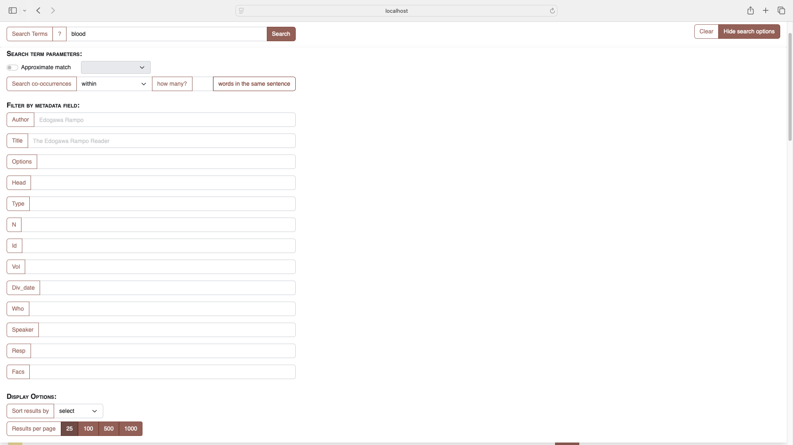
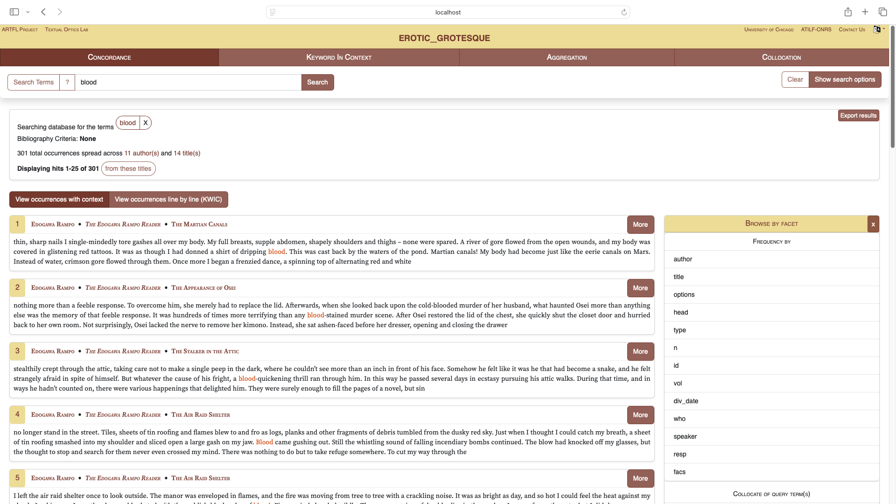
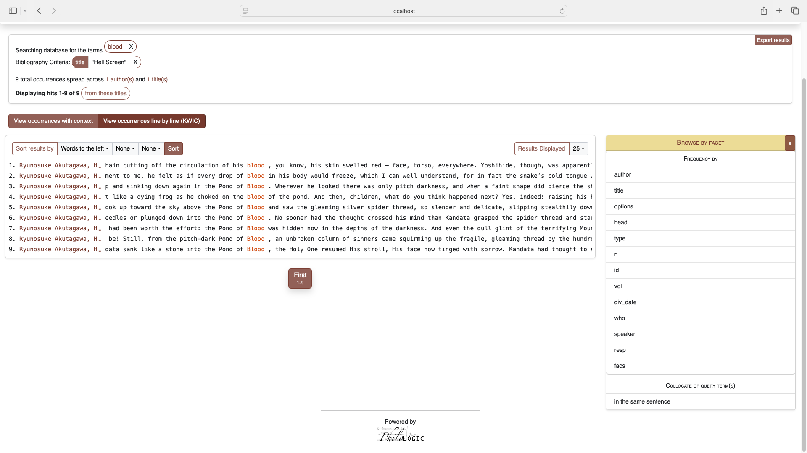
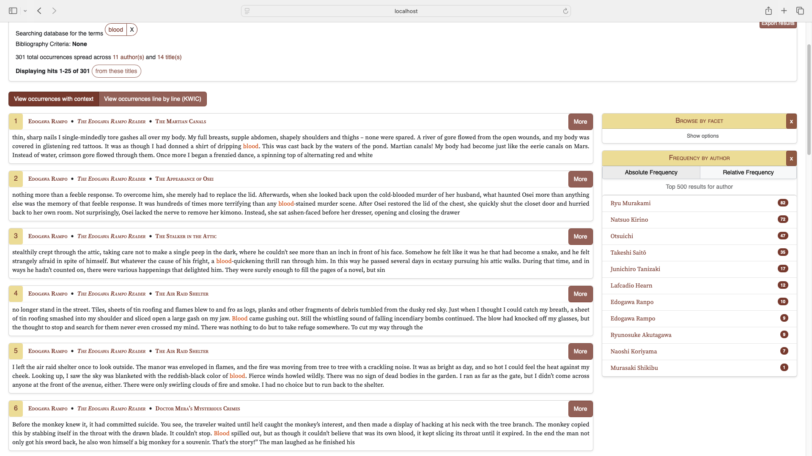
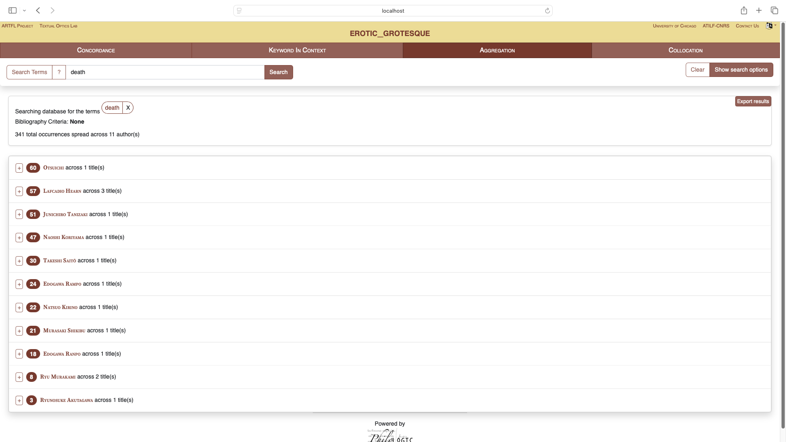
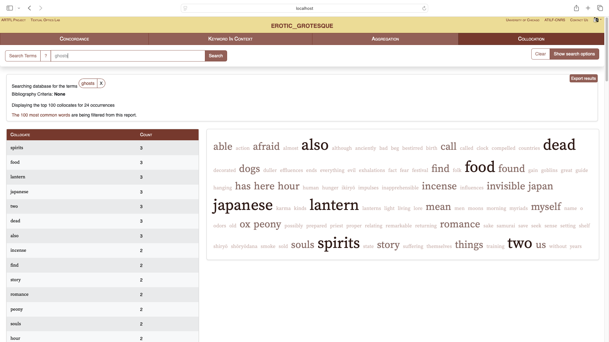

# Searchable Database for Ero Guro Literature (exp. reading time: 5 min. please read this in lieu of browsing!)
## Introduction 
This readme page is an overview of the project. `Because the project is localhosted by Docker and I have not yet found a proper way to publish it online,` this page provides an alternative way to understand what I have done. My corpus-building project takes a range of Japanese ero guro literature (literally, erotic grotesque, an artistic genre mainly emerged in 1920-30 which focuses on depicting eroticism, the supernatural, sexual corruption, and body decay) to study how they share adaptations from premodern Japanese tales and how they are in common in creating this sense of simultaneous erotic and grotesque. In light of this, `my chosen files consist of twelve pieces of 19th-and-20th-century fictions and tales, in addition to two extensive compilations of medieval tales which have been widely adapted and borrowed.` Some of the borrowings, for example those in Lafcadio Hearn’s Kaidan, are fairly clear-cut, presenting explicitly as rendition of the original stories, whereas others could be implicit and intangible, and can only be noticed by paying attention to the use of certain words. I expect my project to shed some light on this. 

`note: my original idea was to construct one for setsuwa or purely medieval texts. However, there are lots of difficulties finding clean data of them, which give extra workloads for the project. This project is more like a practice for this approach, in the hope that the original idea could come true in the future.`
## Components 
The database is constructed through `PhiloLogic,` a suite of software developed by the ARTFL Project at the University of Chicago. By loading the processed corpus (how is this made possible will be specifically expounded later), one will be able to conduct a full-text reserach, with five following functions. For each search option, there are several `filters` available for narrowing down results. 

### Concordance
The concordance function allows users to search for specific words or phrases, `displaying all occurrences in their immediate context.` This is ideal for exploring linguistic patterns, thematic motifs, and intertextual connections. It also reveals how certain words appear across the corpus and their role in constructing a specific genre. Users can click on results to view full passages. 

Example: 

### Keyword in Context (KWiC)
KWiC presents concordance in another pattern. Unlike the concordance tool, `KWiC enables users to analyze the word's role within a sentence or passage.` As it emphasizes interpretive contexts, it is especially useful for exploring recurring motifs or stylistic elements. Also, from the "browse by facet" sidebar, one could filter the result more specifically while having a quick look on their stats (e.g., number of occurence in certain texts/texts of certain author). 

Example:

Sidebar:

### Aggregation 
As the name suggests, the Aggregation feature compiles data from the entire corpus to `reveal broader patterns and trends.` It allows users to quantify the occurence of certain words in works of certain author, as well as the specific number in each work.

Example:

### Collocation 
The Collocation feature identifies words that frequently appear near a given search term. `This is particularly useful for studying how themes are constructed.` For example, seraching "ghosts" makes its surrounding images accessible, which allowes users to intuitively make sense its common pairings.  By analyzing such word pairings, users can explore the stylistic and thematic nuances that characterize the genre.

Example:

## How's this possible? 
To create the PhiloLogic database, I first converted the text (in txt, some of which I converted from ocr-ed pdf firstly) into TEI (Text Encoding Initiative) format, a structured way to organize text so that computers can understand its components, like chapters or themes. I then cleaned the irrlevant information, such as the publisher and the date, and only leaved the content. After preparing the data, I uploaded it into PhiloLogic. Finally, I tested and fine-tuned the system to ensure smooth searches and meaningful results, making the database a powerful resource for studying ero-guro literature. 
### How was TEI Made?
The conversion of TEI started when choosing the original files to process. By this I mean the quality of files selected will largely impact the experience of processing files thereafter and, in this case, low-quality files would add complexities and obstacles, which I indeed encountered. Starting with EPUB files, I originally chose seventeen files in total, with four of them later being eliminated due to the obscurity in their respective TXT generated. For example, chapters of one eliminated file consist of four lines, including one line with four asterisks, one empty line, one chapter number line, and one chapter name line. Since I still had a choice, I thought it would be more efficient to eliminate or replace it rather than sticking here for a long time. The rest fourteen files were, lamentably, processed separately to TEI, for they were all from different sources and none of them are in identical pattern. Yet, they do share a degree of similarities, sometimes in identifying chapter titles while others in identifying subsections, which liberated me from repetitive tasks and just tweaking them a little based on one or two prepared scripts. In other words, this process is more of a matter of permutation and combination. One difficulty I’ve encountered was matching those text-only titles, which sometimes included non-English characters. I ended up writing a list of title strings and to match the list. Another obstacle lies in the file Seven Japanese Tales, where headlines are not only text-only but also have appeared multiple times. My first attempt was to write a line counter, which didn’t work well (as mismatching still happened, or the first headline being eliminated), but was finally resolved by re.compile(). 

However, there are also advantages in processing them separately. For instance, each of them are independent and you can run the script freely without worrying about previously processed TEI being overwritten. I have also left the processed TEI unorganized (i.e., not collecting them in a sub-directory) intentionally, as it allowed me to switch from different files (e.g., to compare one’s TXT and TEI) and to quickly navigate if there are leftovers (for my processing wasn’t completed at a time). Update: I have organized them at the end. 
The work was overall smooth, yet sometimes might not be done in the “smartest” way and, I assume, might be only applicable to this kind of small workload. Further deliberations in optimizing the code will be essential if performing larger-scale conversion. 

`For more tech explanations, see the folder "evaluation"`
